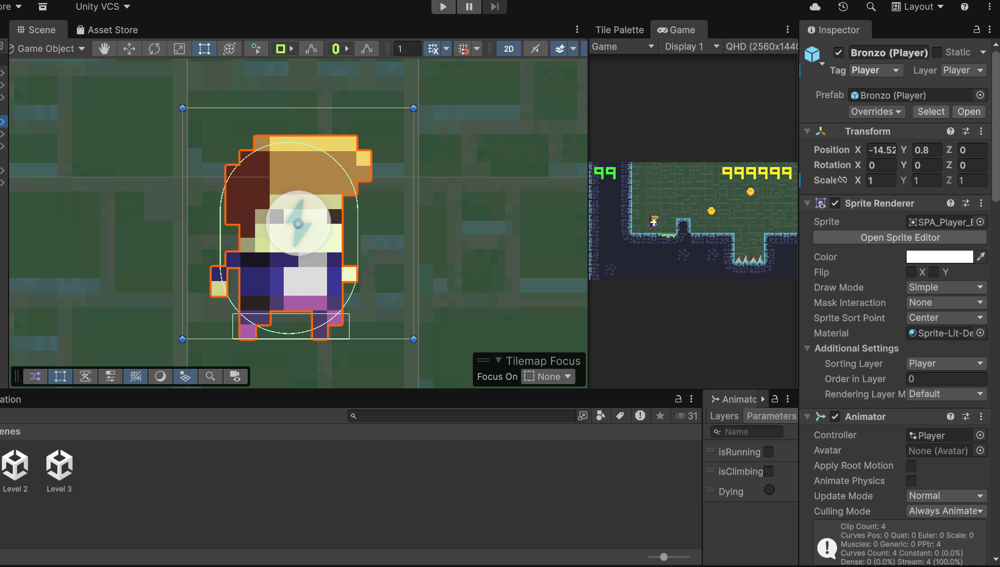
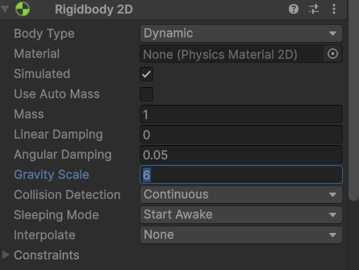
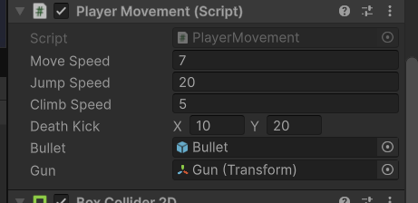
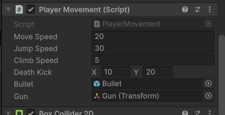
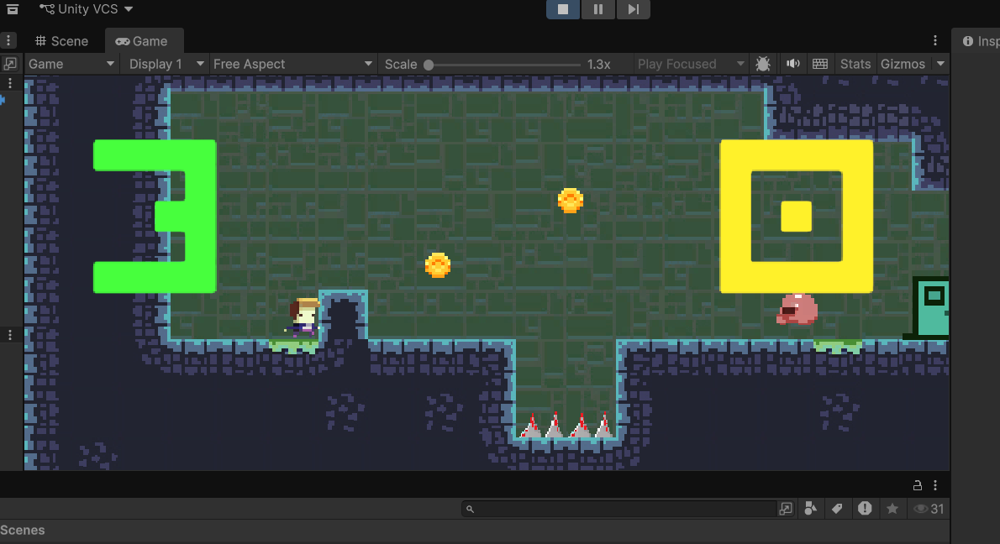
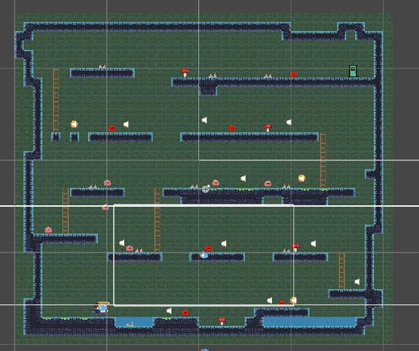

# Lab 02 - Tìm hiểu về dự án TileVania 3

## Thông tin sinh viên
- **Họ tên**: Phan Khánh Vương
- **MSSV**: 2312802
- **Lớp**: CTK47A

- **Họ tên**: Phùng Nguyễn Hoài Bo
- **MSSV**: 2312585
- **Lớp**: CTK47A

- **Họ tên**: Vũ Thế Huỳnh
- **MSSV**: 2312639
- **Lớp**: CTK47A

## Mô tả
Bài thực hành Lab 02 môn **Tìm hiểu về dự án TileVania 3**.

TileVania 3 là game platformer 2D được xây dựng bằng Unity. Người chơi điều khiển nhân vật vượt địa hình, né chướng ngại vật, thu thập coin và tìm cổng qua màn. Dự án giúp làm quen với các thành phần cơ bản của Unity như Prefab, Rigidbody2D, Collider2D, Animation, Scene, và script C# để điều khiển nhân vật.

## Các thay đổi đã thực hiện
1. Thay đổi tốc độ chạy: [gốc] -> [mới]
2. Thay đổi lực nhảy: [gốc] -> [mới]
3. Thay đổi trọng lực: [gốc] -> [mới]
4. Thêm Coin vào scene tại vị trí [...]

## Screenshots
### Hình 1 - Inspector của nhân vật Bronzo

### Hình 2 - Thay đổi trọng lực

### Hình 3 - Thay đổi lực nhảy

### Hình 4 - Thay đổi tốc độ di chuyển (Move)

### Hình 5 - Tổng quan game

### Hình 6 - Màn chơi mới

## Kiến thức đã học được
1. Hiểu cách tổ chức dự án Unity theo thư mục Assets, Scenes, Prefabs, Scripts.
2. Biết cách chỉnh các thông số di chuyển nhân vật trong Inspector và script C#.
3. Nắm được ảnh hưởng của trọng lực và lực nhảy đến gameplay.
4. Thực hành thêm đối tượng Coin vào scene và kiểm tra va chạm/thu thập.
5. Biết cách chụp minh chứng và ghi lại thay đổi bằng tài liệu README.
